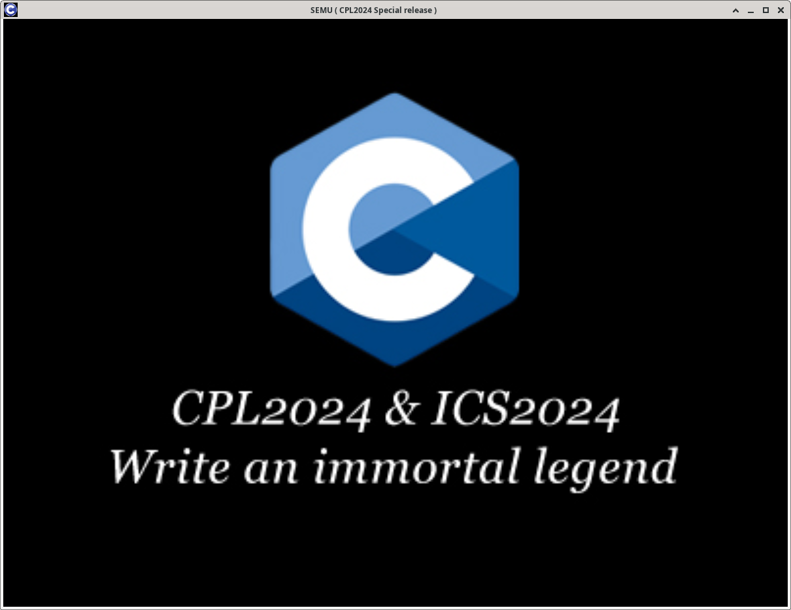
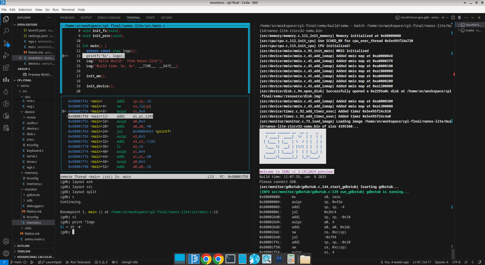

# SEMU
A simple RISC-V 32 emulator for **fun** and **practice**, inspired by **NEMU**.  
This project is the final project for **CPL2024**.




## Installation

### 1. Set up the environment
Install necessary packages from your distro's package manager:
```bash
sudo apt update
sudo apt install build-essential man gdb git libreadline-dev -y
```
Install SDL3: https://wiki.libsdl.org/SDL3/Installation

### 2. Build SEMU
Clone the repository and set up the environment:
```
git clone <repository-url>
cd semu
. scripts/envsetup.sh
```
Generate `.config`:

```
make perf_defconfig
```
or
```
make menuconfig
```
Build:
```
make
```

### 3. Run SEMU
Once the build is complete, you can run the emulator:
```
make run
```

To load a program, you can download prebuilt ones from https://github.com/snnbyyds/semu-examples
```
make run IMG=/path/fceux-mario.bin
```

## Feature Overview
### SEMU Infrastructure
#### kbuild system (`tools/kconfig`, synced from NEMU)

#### debuggers (`src/monitor`)
* sdb (builtin simple debugger with some simple commands)
* gdbstub (an implementation of the GDB Remote Serial Protocol to help debug programs with GDB)

#### snapshot utility (`src/utils`)
* snapshot backup & restore

#### trace (`src/utils`)
* exception / interruption trace
* instruction trace (Powered by capstone 6)
* function trace (NOT implemented)

#### expression calculation
* expression calculator (NOT implemented)

#### difftest
* difftest with NEMU (DUT: SEMU, REF: https://github.com/ics-ext/nemu-ref)
* serve as a REF for difftest (NOT implemented)

### CPU Simulation `src/cpu`
* Common RV32IM instructions (`src/cpu/inst.c`)
* GPRs
* CSRs (Basic ones)
* Fetch, decode, execute cycle (`src/cpu/cpu.c`)
* Basic privileged ISA

( TODO: Make it running even FASTER )

### Memory Simulation `src/memory`
* Basic read and write operations
* RV32 Sv32 paging (WIP)
* TLB simulation (NOT implemented)
* MMIO `src/device/mmio`

### Device Simulation `src/device`
* audio (`src/device/audio.c`)
* disk (`src/device/disk.c`, Untested)
* keyboard (`src/device/keyboard.c`)
* serial (`src/device/serial.c`, Input not implemented)
* timer (`src/device/timer.c`)
* vga (`src/device/vga.c`)

## About HALs and programs
I haven’t had the chance to develop our own Hardware Abstraction Layer, the `SAL` yet, so for now, I’ve only ported the `abstract-machine` as the abstraction layer. However, since the code in `abstract-machine`, `nanos-lite`, and `navy-apps` is related to **the ICS2024 Programming Assignment**, it ***cannot be made public***. Therefore, they will only be distributed in the form of precompiled binaries.

## Contributing
Feel free to fork the repository and submit a pull request if you’d like to contribute. Bug fixes, performance improvements, and new features are always welcome! Please ensure your contributions follow the coding standards and include appropriate tests.
